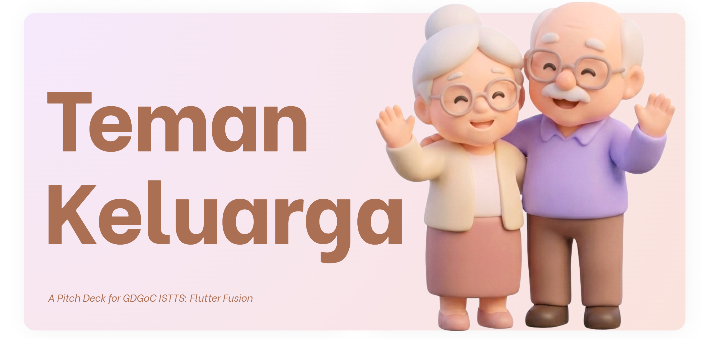
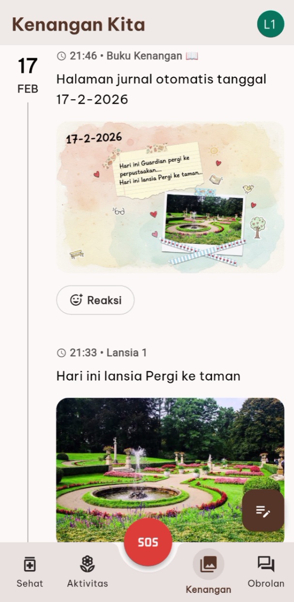
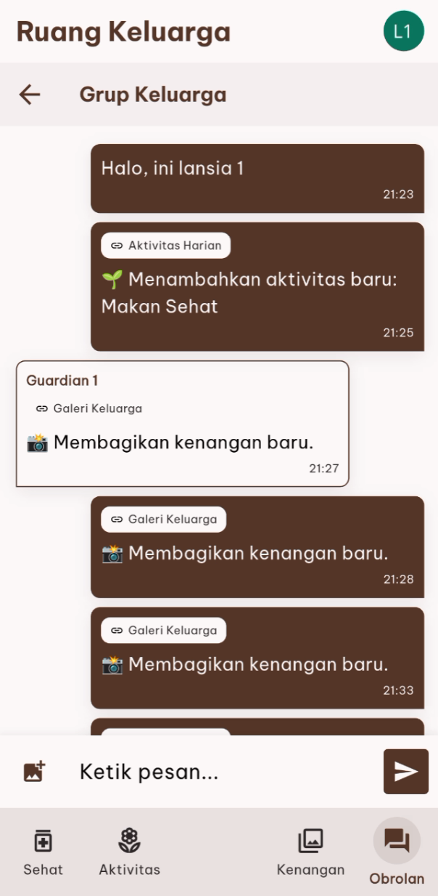

# Teman Keluarga 🍂

<!-- Ganti dengan banner aplikasi jika ada, atau hapus baris ini -->

**Silver Guide** adalah aplikasi pendamping keluarga premium yang dirancang khusus untuk mempererat hubungan antara Lansia (Orang Tua) dan Pendamping (Anak/Keluarga).

Dibangun dengan filosofi **"Luxury Accessibility"**, aplikasi ini menggabungkan desain bertema *Autumn* yang hangat, tipografi yang mudah dibaca, dan kecerdasan buatan (AI) untuk membantu manajemen kesehatan, kebahagiaan, dan kenangan keluarga.

---

## ✨ Fitur Utama

### 1. 🏥 Manajemen Kesehatan (Health)
*   **Timeline Obat:** Jadwal minum obat harian yang mudah dibaca dengan status *real-time*.
*   **Guardian Control:** Pendamping dapat menambah, mengedit, dan menghapus jadwal obat (support durasi, frekuensi hari, dan foto obat).
*   **Smart Notification:** Alarm lokal untuk Lansia (tetap bunyi tanpa internet) dan notifikasi laporan untuk Guardian.

### 2. 🌻 Aktivitas & Kebun Kebahagiaan (Activities)
*   **Gamifikasi:** Lansia diajak melakukan hobi positif. Setiap aktivitas yang selesai akan menyuburkan "Pohon Keluarga" digital.
*   **Rekomendasi Visual:** Pilihan aktivitas dengan ilustrasi menarik atau upload foto aktivitas sendiri.

### 3. 📖 Buku Kenangan (Memories)
*   **Family Feed:** Jurnal foto keluarga privat.
*   **AI Scrapbook Generator:** Menggunakan **Gemini 3 Pro Image**, aplikasi dapat "melukis" rangkuman cerita hari itu menjadi satu halaman *scrapbook* digital yang estetik secara otomatis.
*   **Reaksi & Zoom:** Interaksi hangat antar anggota keluarga.

### 4. 💬 Ruang Keluarga & AI (Chat)
*   **Realtime Chat:** Grup obrolan terintegrasi untuk seluruh anggota keluarga.
*   **System Logs:** Semua aktivitas penting (Minum obat, SOS, Postingan baru) tercatat otomatis di chat.
*   **🔴 Tanya AI (Gemini Live):** Fitur percakapan suara dua arah (*Voice-to-Voice*) dengan AI secara *real-time* dan *low-latency* untuk menemani lansia mengobrol.

### 5. 🛡️ Keamanan & Peran (Roles)
*   **Tombol SOS:** Akses cepat untuk situasi darurat.
*   **Dual Role UI:**
    *   **Lansia:** UI Besar, Sederhana, Fokus pada aksi.
    *   **Guardian:** UI Dashboard Ringkasan (Overview) untuk memantau banyak lansia sekaligus.

---

## 🛠️ Teknologi yang Digunakan

Aplikasi ini dibangun menggunakan **Flutter** dengan arsitektur yang bersih dan modern:

*   **State Management:** [Riverpod](https://riverpod.dev) (StreamNotifier & Provider).
*   **Backend:** Firebase (Auth, Firestore, Storage, Cloud Messaging, AI Logic, Functions).
*   **Generative AI:**
    *   `firebase_ai` & `google_sign_in`: Untuk autentikasi dan akses model.
    *   **Gemini 3 Pro Image:** Untuk generate Scrapbook.
    *   **Gemini Live API:** Untuk fitur Voice Assistant interaktif.
---

## 📸 Tangkapan Layar

| Halaman Sehat | Guardian Mode | Memories AI Scrapbook | Chat Room |
|:---:|:---:|:---:|:---:|
|  |  |  |  |

*(Ganti path gambar di atas dengan screenshot aplikasi Anda nanti)*

---

  Dibuat dengan ❤️ oleh Kevin Jonathan, Jenny Elizabeth, dan Alexander Erick.

